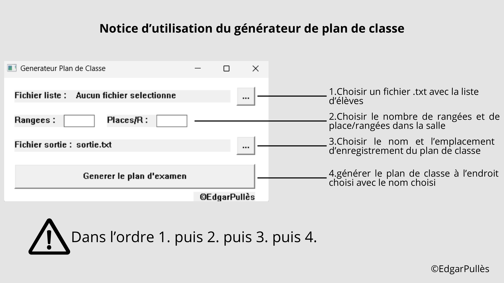

## 🦊 Class Map

  

## 🎓 Le Projet
**Class Map** (Générateur de plan de classe) est l'outil idéal pour les enseignants et les formateurs. Fini le casse-tête de la répartition des élèves ! Cette application vous permet de créer des plans de classe en quelques clics de manière aléatoire.

### 🛠️ Fonctionnalités
* **🔀 Génération aléatoire** : Mélangez aléatoirement les places instantanément pour dynamiser votre classe
* **✍️ Gestion manuelle** : Ajustez le nombre de places dans une salle manuellement avant la génération
* **💾 Sauvegarde locale** : Enregistrez vos plans pour les réutiliser plus tard sans perte de données

## 📖 Notice d'Utilisation

Voici comment prendre en main votre générateur en 4 étapes simples :

1. **Ajout des élèves** : Ajout d'une liste dans un fichier .txt
2. **Configuration** : Définissez le nombre de rangées et de colonnes de votre salle
3. **Sauvegarde personnalisée** : Choisissez où et avec quel nom sauvegarder le fichier généré
4. **Génération** : Cliquez sur le bouton "Générer" pour une répartition automatique aléatoire

## 📸 Aperçu de l'Interface

<table width="100%">
  <tr>
    <td width="50%" align="center">
      <b>💻 Notice d'Utilisation Logiciel</b> 
      
    </td>
  </tr>
</table>

## 💻 Stack Technique

  

## 🌸 Keep Pushing !
> Si cet outil vous aide à gérer votre classe plus sereinement, n'hésitez pas à laisser une ⭐ sur le repo pour soutenir le projet ! 
> | ©EdgarPullès
